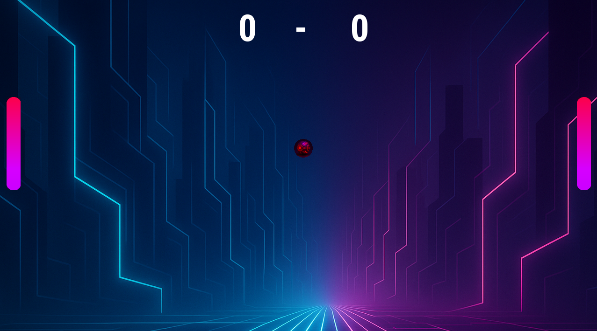

# Pong Game

This is the implementation of the Pong game with a counter in a futuristic design. For the implementation SFML (Simple and Fast Multimedia Library) is used. It can be downloaded here: https://www.sfml-dev.org/download.

## Usage with Visual Studio

1. Right click on Project -> Properties
2. C/C++ -> General -> Additional Include-Libraries: Paste the path to the include folder of SFML
3. Linker -> General -> Additional Library Directories: Paste the path to the lib folder of SFML
4. Linker -> Input -> Additional Dependencies: Paste the follow:
    - sfml-graphics-d.lib
    - sfml-window-d.lib
    - sfml-system-d.lib
5. Copy dll files into your Debug or Release folder

## Play the Game

The left paddle is controlled with the keys **W** for up and **S** and down. The right paddle is controlled with the keys ⬆️ for up and ⬇️ for down. Pressing the whitespace key, the game gets started. The current score is shown at the top of the window.

